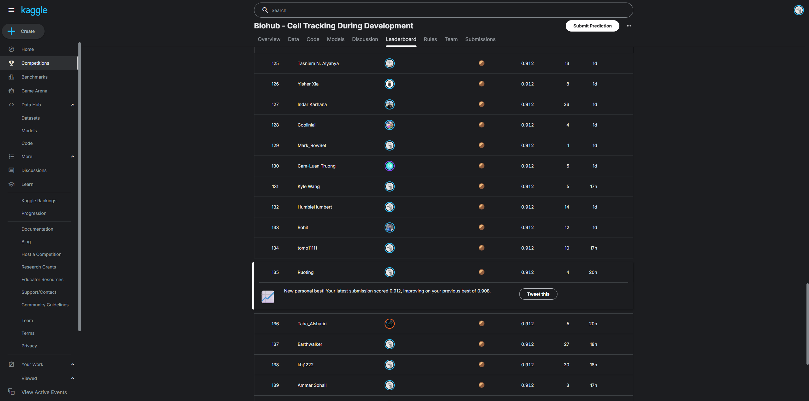

# Biohub Cell Tracking During Development

Reproducible, no-exploit inference and graph-reconstruction workflow for the
Kaggle research competition
[Biohub - Cell Tracking During Development](https://www.kaggle.com/competitions/biohub-cell-tracking-during-development).

This repository follows two public method lines: a clean single-seed tracking
pipeline at `0.908`, and a calibrated dual-seed pipeline with center-confirmed
gap repair at `0.912`. The executable E025 integration in this repository has
now independently achieved a verified public score of `0.912`.

## Verified Results

| Experiment | Public submission | Public score | Interpretation |
|---|---:|---:|---|
| E000 clean reproduction | `54923913` | `0.908` | Verified single-seed baseline |
| E016 embryo-aware dual-seed router | `54972789` | `0.908` | Stable, but no leaderboard gain |
| E025 guarded global dual-seed integration | `55023652` | **`0.912`** | Verified `+0.004` over E000/E016 |

The E025 score belongs to this repository's submitted Kernel version 1:
[biohub-e025-guarded-dual-seed-center-gaps](https://www.kaggle.com/code/buaaauto/biohub-e025-guarded-dual-seed-center-gaps?scriptVersionId=338254608).

## Public Leaderboard Snapshot



*Captured on 2026-07-28. The leaderboard is dynamic; this screenshot records
the displayed rank and score at capture time.*

## Shared Tracking Pipeline

Both method lines use pretrained inference artifacts rather than training
models inside the submission Notebook:

```text
3D+t microscopy
  -> TemporalUNet3D detection field and features
  -> spatial D4 test-time augmentation
  -> cell-center point extraction
  -> node-transformer adjacent-frame association scores
  -> constrained ILP lineage construction
  -> motion, gap, fragment, smoothing, and division repair
  -> topology audit
  -> submission.csv
```

The graph formulation is central to the approach. Learned detections and edge
scores provide proposals, while the ILP and postprocessor enforce temporal and
biological consistency across the complete lineage.

## Method A: Clean Single-Seed Baseline (`0.908`)

The clean baseline is derived from Yusuke Togashi's
[Clean Approach + Lightweight Local CV | No Hack](https://www.kaggle.com/code/yusuketogashi/clean-approach-lightweight-local-cv-no-hack?scriptVersionId=337292811)
Notebook.

### Detection and association

- A TemporalUNet3D processes two-frame windows and produces a volumetric
  center field plus features for association.
- Detection logits are averaged over the eight spatial symmetries of the
  `x-y` plane (D4 TTA).
- Center points are extracted at detection threshold `0.96875`.
- A node transformer scores candidate links between cells in consecutive
  frames using image features, physical coordinates, and relative position.

### Lineage optimization

The initial graph is selected by a constrained ILP with edge weight `-1.0`,
appearance cost `0.0`, disappearance cost `1.575`, and division cost `1.0`.
Edges must advance exactly one frame, each node may have at most one parent,
and binary division permits at most two children.

### Graph repair

- Motion-aware bipartite reassignment uses tight and relaxed gates of
  `6.0/9.5 um`.
- One-missing-frame gaps may be repaired by reusing an observed point or
  inserting and refining a synthetic midpoint.
- Components shorter than six nodes are normally removed, while components
  containing a division are retained.
- The public revision tested a conservative rescue for exactly five-node
  components with mean edge probability at least `0.90`, mean displacement at
  most `2.75 um`, and a maximum budget of 60 nodes.
- Linear track interiors are smoothed without changing graph topology, and
  tightly capped geometric repairs may add a second child for a plausible
  division.

The rescue branch recovered 12 components and 60 nodes on the hidden test, but
its fixed-eight local validation score was slightly below its reference.
Accordingly, `0.908` is treated as evidence for the complete clean tracking
pipeline, not as evidence that short-track rescue alone improved the metric.

## Method B: Guarded Dual-Seed Integration (`0.912`)

E025 adapts the globally calibrated ensemble and center-confirmed gap settings
from Pilkwang Kim's pinned
[Two Seeds Logit Blend v40](https://www.kaggle.com/code/pilkwang/biohub-cell-tracking-two-seeds-logit-blend?scriptVersionId=337798568),
while retaining this repository's fail-closed artifact checks and binary
safe-division guard.

### Shared dual-seed detections

The primary and independently seeded temporal models both run spatial D4 TTA.
For each frame, the secondary detection field is aligned to the primary
field's mean and standard deviation before blending:

```text
shared_detection = 0.525 * primary + 0.475 * aligned_secondary
```

One shared point set is extracted from this fused field. Both node transformers
therefore score the same physical cells rather than producing two incompatible
coordinate sets.

### Low-margin link consensus

Secondary edge evidence is used only when the primary association is
uncertain:

- maximum primary top-two margin: `0.35`;
- maximum secondary edge weight: `0.15`;
- candidate edge threshold after calibration: `0.48`;
- secondary evidence is applied only when both models select the same best
  parent;
- disagreement leaves the primary edge score unchanged.

This preserves confident primary links while using independent evidence on
ambiguous associations.

### Global lineage and center-confirmed gaps

- ILP disappearance cost is reduced from `1.575` to `1.5`.
- Motion reassignment uses `6.0/10.0 um` tight and relaxed gates.
- DeepCenterUNet3D is not a second global detector. It only confirms newly
  synthetic one-frame gap midpoints whose endpoint span is at least `8.5 um`.
- The center threshold is `0.25`, the required checkpoint epoch is `500`, and
  observed or shorter-gap points bypass the gate.
- DeepCenter does not change accepted transformer edges or division
  decisions, and its safe-division veto is disabled.

In the scored E025 run, DeepCenter checked 263 long synthetic midpoint
proposals and rejected all 263. It therefore acted as a precision gate against
unsupported gap filling rather than adding new detections.

## E025 Execution Evidence

Kernel version 1 completed inference in `9.12` minutes and produced:

| Artifact statistic | Value |
|---|---:|
| Test datasets | `4` |
| Node rows | `119,039` |
| Edge rows | `114,863` |
| Total submission rows | `233,902` |
| Submission SHA256 | `78598f236bee33d2228096f4a4c19286e9a53cd49f2bcdf9eca2c652283fea3d` |

The downloaded output independently passed sequential-row, schema,
coordinate, dangling-edge, duplicate-edge, temporal-edge, maximum-indegree-one,
and maximum-outdegree-two checks. The primary, independent-seed, and
DeepCenter model files were verified from their materialized bytes before
inference.

The `+0.004` public improvement is the result of a combined configuration:
global dual-seed detection blending, low-margin link consensus, ILP and motion
calibration, and center-gated gap repair. Because these changes were submitted
together, the leaderboard result does not establish the isolated causal
contribution of any one component.

## Reproducibility and Scope

- No hidden-test labels, metric exploits, artificial hubs, negative-time
  nodes, out-of-volume nodes, or cross-dataset edges are used.
- Model checkpoints and external Notebook states are checksum-pinned.
- The submission Notebook fails closed when required artifacts or topology
  contracts do not match.
- Searched divisions and label-dependent dataset routing are disabled in E025.
- The embedded candidate-status cell records the pre-submission state of the
  executed Notebook; the terminal score is the verified Kaggle result reported
  above.

This repository describes E025 as an attributed engineering integration over
the verified `0.908` baseline, not as an independently invented `0.912`
method. Matching the public v40 score does not transfer authorship of the
upstream method.

See [NOTICE.md](NOTICE.md) for exact source versions, hashes, and reuse
attribution.

## Public Files

- `kaggle/biohub_clean_baseline.ipynb`: complete executable E025 Notebook.
- `kaggle/kernel-metadata.json`: accepted Kaggle Kernel configuration.
- `kaggle/validate_e006_postprocess.py`: controlled postprocessing validator,
  including the externally pinned public-v40 parity mode.
- `kaggle/audit_deepcenter_rescue.py`: sparse-label detector-complement audit.
- `kaggle/run_dual_seed_control.py`: pinned independent-seed inference control.
- `kaggle/audit_hoct_rerank.py`: HOCT edge-ranking compatibility audit.
- `kaggle/audit_e000_error_budget.py`: official-matcher error-budget audit.
- `NOTICE.md`: attribution and reuse notice.
